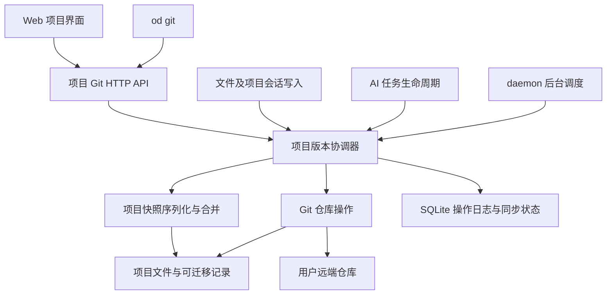

# 项目 Git 版本管理与完整恢复设计

日期：2026-09-05

状态：对话中的产品设计及本文均已获用户确认，进入实施计划阶段。产品实现尚未开始。

基线：`main`，`bbaeeb911`。本文描述 Open Design 内部用户项目的版本管理。

## 1. 目标与已确认决策

每个项目使用标准 Git 仓库保存项目版本，可配置一个远端仓库和目标分支。文件、可迁移的项目设置、聊天记录及恢复这些内容所需的资源一起进入版本。用户能在另一台电脑从仓库打开项目，恢复内容和工作上下文，并继续编辑。

以下产品决策已经在对话中确认：

| 事项 | 确定行为 |
| --- | --- |
| 运行结构 | 保留 daemon、SQLite 和项目工作目录；Git 保存完整项目快照，导入时重建本地运行记录 |
| 多端使用 | 支持其他电脑、其他人及外部编辑器提交到同一目标分支 |
| 自动保存 | AI 任务结束后保存；手动变更停止 5 秒后合并保存；无变化不提交 |
| 并发任务 | 同一项目所有写文件任务结束后，才生成一致的项目版本或应用远端更新 |
| 自动同步 | 打开项目、启动任务前检查远端；daemon 后台每 60 秒检查一次 |
| 同步冲突 | 保留双方内容，暂停自动同步，用户确认合并结果后继续 |
| 断网 | 保留本地提交，持久记录待推送状态，联网或重启后重试 |
| 历史恢复 | 文件、设置和聊天一起恢复；在当前分支新增恢复提交，保留中间历史 |
| 新项目 | 默认建立本地 Git 仓库，绑定远端后开启自动推送 |
| 旧项目 | 按项目启用，当前状态作为首个完整版本，保留旧 HTML 文件历史 |
| 普通仓库 | 支持导入；缺少 Open Design 元数据的历史提交只恢复文件，沿用当前设置和聊天 |
| 操作入口 | Web UI 和 `od` CLI 同步交付，调用同一套 daemon API |

一个版本的“完整”以纳入版本管理的项目内容为范围。忽略的依赖缓存、本机凭据和外部服务状态不属于项目版本；启用和导入界面必须展示这个边界。

## 2. 当前实现与改造入口

结论依据上述基线的源代码，不把旧快照目录、注释中的历史命名或未来存储适配器当成当前运行入口。

| 当前入口 | 已核对行为 | 改造位置 |
| --- | --- | --- |
| `apps/daemon/src/server.ts` | 解析统一数据根，注册项目 API、运行任务；项目上传附件写入项目实际工作目录 | 注入 Git 服务、恢复未完成操作、接入任务生命周期 |
| `apps/daemon/src/projects.ts` | `resolveProjectDir` 选择托管目录或导入项目的 `metadata.baseDir` | 复用目录权限与路径校验，协调文件变更边界 |
| `apps/daemon/src/import-export-routes.ts` | `/api/import/folder` 打开本地目录并创建项目与会话记录 | 复用经过验证的项目初始化逻辑，Git 导入采用独立领域路由 |
| `apps/daemon/src/db.ts` | SQLite 保存项目、会话、消息；消息使用稳定 ID 和会话内 `position` | 导出可迁移数据、维护本地 ID 映射、事务化恢复 |
| `apps/daemon/src/runtimes/chat-run-messages.ts` | 运行事件分批持久化，结束时归并消息 | 等待文件与消息完成落盘后建立版本 |
| `apps/daemon/src/server.ts` 的任务结束路径 | 成功路径已有 HTML 快照；失败、取消和退出存在不同路径 | 在统一终态收敛处接入，覆盖全部终态与重叠任务 |
| `apps/daemon/src/run-artifact-fs.ts` | 同一工作目录存在重叠运行时标记 `contended` | 版本边界按项目及实际仓库共同协调，不依赖单次 run 的独占文件差异 |
| `apps/daemon/src/project-file-versions.ts` | `.file-versions` 保存单个 HTML 文件的内容与清单 | 保留旧历史读取，Git 启用后以项目提交承接新历史 |
| `apps/daemon/src/routes/project/index.ts` | 单文件版本、恢复、上传、保存、重命名、删除等入口 | 写操作进入统一变更协调，保留原有领域职责 |
| `apps/daemon/src/project-watchers.ts` | 文件监听随订阅创建和关闭；无页面订阅时不会保持监听 | 自动同步拥有 daemon 生命周期，不能只依靠 UI 的文件监听 |
| `apps/web/src/state/projects.ts`、`HomeView.tsx`、`ProjectView.tsx`、`FileViewer.tsx` | 项目导入、项目界面、文件历史与预览入口 | 添加仓库导入、项目历史、同步状态与冲突界面 |
| `packages/contracts/src/api/projects.ts`、`chat.ts` | 项目设置含本机路径、运行绑定；消息含附件、运行事件和插件快照引用 | 新增明确的可迁移格式，禁止原样导出整个数据库对象 |

产品文件操作目前主要通过项目模块和路由执行。本设计不以全面替换 `ProjectStorage` 或重写所有数据库读写为前置工作，也不新增 sidecar 业务分支。

## 3. 范围与交付边界

这是一个完整的项目版本管理能力：仓库格式、Git 操作、持久同步、导入恢复、UI 和 CLI 必须在同一功能交付中闭合。实现计划可以按合同、服务、消费者和集成验证组织任务，不把其中一个用户操作的 CLI 或 UI 留待后续交付。

第一版支持每个项目一个仓库和一个目标分支。目标分支可在建立或重新配置绑定时选择；切换已有绑定需要先暂停同步、保存当前状态并通过变更预览。版本历史展示真实 Git 提交图，合并提交也属于历史。

第一版不提供仓库托管服务、创建远端仓库、PR 管理、任意分支管理界面或 AI 自动裁决冲突。远端地址对应用户已创建且有权访问的仓库。

Git 普通文件及二进制对象在范围内。第一版不自动把文件迁入 LFS，也不递归管理子模块。检测到 LFS 指针、子模块或缺失的外部资源时，明确列出依赖及受影响内容；未取齐必需内容时不能报告“完整恢复”。这些仓库可先在外部工具中物化依赖，再通过检查继续，不能把指针文件当成已恢复的图片或视频。

## 4. 组件与责任



| 单元 | 责任及依赖 |
| --- | --- |
| 契约 | `packages/contracts/src/api/project-git.ts` 定义 HTTP DTO、可迁移格式、操作状态、冲突与错误类型；保持纯 TypeScript |
| Git 适配器 | `apps/daemon/src/services/project-git/` 内封装探测、初始化、取对象、构造提交、引用检查、推送、读取历史；不依赖 Express |
| 可迁移快照 | 同领域内导出、校验、导入项目记录，收集资源，执行结构化三方合并；依赖窄数据库和文件接口 |
| 协调器 | 收敛变更、等待任务落盘、建立检查点，串行执行合并和恢复，处理版本过期及重启恢复 |
| 持久状态 | `apps/daemon/src/storage/` 内管理仓库绑定、ID 映射、项目修订号、操作日志、待推送目标及重试信息 |
| HTTP 路由 | `apps/daemon/src/routes/project-git.ts` 校验输入和项目读写权限，委托服务；由 `server.ts` 对应领域段注册 |
| CLI | `apps/daemon/src/cli/` 内的领域模块实现 `od git`；`src/cli.ts` 仅通过 `SUBCOMMAND_MAP` 组装 |
| Web | 新的项目 Git 状态、设置、历史和冲突组件放在 `apps/web/src/`；复用当前项目状态与预览刷新机制 |

协调器按实际 Git 仓库和工作目录进行跨进程互斥，并对 Git 引用执行基准校验，不能只按数据库 project ID 使用进程内锁。同一本地工作目录的重复导入须识别已有绑定；一个仓库不能因多个项目 ID 或 daemon 实例出现互不知情的同步队列。Git worktree 如共享同一 Git common directory，也必须共享 Git 写操作协调；第一版拒绝在同一本机仓库中将同一目标分支绑定为两个可写项目。其他机器的独立克隆仍按正常双向同步处理。

数据根继续严格遵循根 `AGENTS.md` 的 **Daemon data directory contract**。新增本地状态进入现有 SQLite，临时物化空间由 `server.ts` 从已解析的数据根提供；不定义另一套 daemon 路径约定。导入的本地目录仍通过现有 `metadata.baseDir` 规则解析。下节目录仅定义用户 Git 仓库中的可迁移格式。

## 5. 仓库内容与可迁移格式

### 5.1 目录结构

用户文件保持普通仓库目录结构，Open Design 记录放入专用目录：

```text
<project repository>/
  <用户项目文件和素材>
  .open-design/
    manifest.json
    project.json
    conversations/<conversation-id>/
      conversation.json
      messages/<message-id>.json
    resources/<content-digest>/...
    legacy-file-history/...
```

`.open-design` 是版本化项目内容，不能被 Git 同步的排除规则忽略。普通文件浏览器可以折叠它；Git 跟踪范围不能直接复用预览文件列表或 UI watcher 的忽略列表。已有 `.open-design` 若不是可识别格式，启用失败并提示目录冲突，不能覆盖。

不把 SQLite 文件提交到仓库。格式使用 UTF-8、稳定键顺序、固定序列化规则与相对路径；没有语义变化的重复导出必须产生相同字节。对象格式带 `schemaVersion: 1`，更高且不支持的版本禁止写入和降级重建。

### 5.2 标识与必需字段

| 文件 | 必需内容 |
| --- | --- |
| `manifest.json` | `schemaVersion`、稳定的 `repositoryProjectId`、资源索引；资源项包括摘要、相对路径、用途及被引用记录 |
| `project.json` | 名称、创建时间、项目类型、入口文件、自定义指令、待处理的用户初始提示词，以及明确允许迁移的设置与内容依赖引用 |
| `conversation.json` | 稳定会话 ID、标题、模式、创建时间；消息顺序由消息记录中的前序引用组成 |
| 消息记录 | 稳定消息 ID、会话 ID、角色、内容、时间、前序消息 ID、所属轮次 ID；附件与产物相对引用、可展示的终态和历史上下文 |
| 资源索引 | 项目使用的设计规范、技能或插件内容快照、必要的项目外本地附件；记录内容摘要及来源信息 |

`repositoryProjectId` 和消息、会话的可迁移 ID 在跨设备同步时保持稳定。本地数据库 ID 通过独立映射生成，避免同一数据根导入其他仓库时与现有记录冲突。相同仓库项目和相同工作目录重复打开，返回已有项目；同一个可迁移项目的另一个克隆在注册时明确显示已有副本，不能覆盖已有本地记录。

项目导出采用允许列表：保留用户项目意图、模型选择、显示设置和内容引用；模型选择是偏好，不表示新电脑已经安装或授权。`baseDir`、`fromTrustedPicker`、工作区权限、连接器令牌、原生会话 ID、运行进程及队列状态均由本机重新解析或生成。外部关联目录保存用途标签和重新定位需求，不能从仓库里的绝对路径直接获得本机读写权限。

插件和设计系统保存项目实际使用的内容快照、版本与可展示上下文。历史快照中的授权、信任标记、MCP 地址及 connector resolved 状态不能成为新机器的执行授权。恢复后的历史任务以终态记录展示；待回答的旧运行表单只能作为历史展示，继续工作从新的任务开始。

### 5.3 附件及历史内容的完整性

当前项目上传入口已把附件放到项目实际目录。导出时把附件引用转换为仓库相对引用；导入时重新生成当前本地文件 API 引用，不能复用旧 daemon 的端口、URL 或 project ID。

仍被聊天记录引用、但已从工作文件区移除的附件，必须保有按摘要引用的资源副本。项目外的 daemon 所有附件也按项目引用收集；不批量复制全局 artifact、其他项目或用户关联目录。缺失必需字节时返回明确缺失项，不能产生标注“完整”的版本。用户自行引用的外部网页只保存引用，不承诺归档整个互联网资源。

消息导出保留恢复聊天展示需要的文本、附件、已持久化事件摘要和上下文。运行遥测、诊断日志、原生会话恢复标识与本机执行能力不作为迁移授权或恢复任务的依据。对包含本机文件引用的事件做引用转换；不能转换的非必需诊断引用显示不可用，并与必需附件缺失区分。

### 5.4 跟踪范围

普通项目文件遵循用户 Git 跟踪和忽略规则；新项目提供排除依赖、构建产物、缓存、日志及本机私有配置的默认规则。初始化前展示会纳入的范围，已被忽略但又被项目声明为必需内容的文件要明确报告，不能静默形成不完整快照。

已有仓库的已跟踪文件不能因为预览层忽略了该目录而被自动删除。凭据和机器私有状态禁止由 Open Design 自动加入提交；发现它们已处于待自动版本化范围时，暂停启用并说明需先处理的路径，不输出内容。旧仓库已有的历史不会被自动重写或清理。

## 6. 本地运行状态与恢复协议

Git 保存可迁移历史；SQLite 与工作目录是当前本机的运行状态。两者通过可重试的操作协议协调，不宣称文件系统、Git 引用与 SQLite 处于同一个原子事务。

本地持久模型包含：

| 记录 | 核心字段 |
| --- | --- |
| 仓库绑定 | 本地 project ID、仓库身份、工作目录绑定、目标分支、远端地址的脱敏展示、自动同步开关 |
| 修订状态 | `projectRevision`、`contentRevision`、最近已导出的内容修订、最近物化的提交、最近远端观察及确认的提交 |
| ID 映射 | 仓库项目 ID、可迁移会话与消息 ID 到本地 ID 的映射 |
| 操作日志 | `operationId`、类型、阶段、基准 HEAD、基准修订、候选提交、预期受影响路径及内容摘要、恢复材料引用 |
| 推送队列 | 绑定版本、目标分支、待推送的最新提交、重试时间、次数与结构化错误 |

远端地址、凭据来源和本机同步开关不由历史项目元数据决定。恢复旧版本不会把当前绑定改回旧服务器或重新启用另一台电脑的自动同步设置。

`projectRevision` 表示当前项目基线的代次，仅在恢复、远端结果物化等替换当前基线的操作时推进；`contentRevision` 跟踪日常文件、消息和设置的变化。正常编辑及一次本地检查点不使同一代次的在途任务失效。预览同时绑定两者，防止尚未生成 Git 提交的新编辑漏过过期检查。

对于应用合并或恢复结果，使用以下可恢复阶段：

1. **准备**：持久记录基准；在独立空间读取并验证候选树、完整项目记录和资源。
2. **保护**：保存当前未提交变化；持久记录将改写文件的原内容及路径清单。若保护检查点推进了 HEAD，在同一操作日志中记录新的发布基准和父提交，并验证内容仍与用户确认的预览一致；其他变化使预览失效。
3. **应用文件**：在短暂项目写入屏障内按清单物化。只删除版本管理范围内、目标树确认不存在的文件，保留忽略文件。
4. **应用数据**：在 SQLite 事务中导入项目、会话、消息及 ID 映射，推进本地项目修订。
5. **发布**：以保护阶段确定的 HEAD 条件更新分支，并在索引基准未被用户改动的前提下同步正常工作索引，确认文件与数据库对应候选提交；解除屏障，刷新 UI，安排推送。

每一阶段先记录足够的重试或回退信息，再产生依赖该信息的副作用。进程重启时依据记录和内容摘要判断实际完成位置；未完成收敛前，该项目处于 `recovering`，阻止新的写入和任务启动。可安全继续则继续，基准被外部改动时保留恢复材料并报告人工处理，不能猜测成功或自动覆盖新内容。

文件、项目设置和聊天的当前状态读取也受物化屏障约束，发布前等待，超过请求等待上限返回可重试的 `PROJECT_BUSY`；状态查询和 Git 历史读取继续可用。不能在文件已经更新、数据库尚未提交时向 UI 交付混合的当前状态。

外部编辑器不遵守 daemon 的写入锁。快照读取前后比较文件集合及摘要，应用前核对待覆盖路径；检测到外部保存、Git 操作或 HEAD 改变就推迟或重新预览。外部持续写入时不能承诺全项目瞬时原子快照。应在 UI 中明确要求合并和恢复阶段暂停外部编辑；实现不得用“加了项目锁”作为外部写入已被阻止的证明。

### 6.1 防止旧页面回写

恢复或应用远端数据后，旧浏览器页面、已排队的保存和任务请求可能仍携带恢复前的内容。Git 管理项目必须在现有修改契约中携带 `expectedProjectRevision`，由 daemon 在变更入口校验；过期或缺失时返回 `409 PROJECT_STATE_CHANGED`，客户端重新加载后再由用户继续操作。

该约束覆盖文件、项目设置、会话和消息修改以及任务启动；CLI、MCP 和应用内部入口通过同一服务获取和校验修订，不能绕过。内部任务在创建时绑定修订，结束时只更新所属运行的数据。

非 Git 管理的旧项目维持现有请求行为。已有项目通过显式启用进入新协议，所有第一方客户端在同一交付中更新；第三方客户端的错误响应给出重新读取项目状态的动作提示。历史读取、文件读取和一般项目列表保持现有契约。

## 7. 自动检查点

### 7.1 触发与合并

| 触发 | 规则 |
| --- | --- |
| 新项目创建 | 默认初始化本地仓库；有 Git 与提交身份时创建首个完整提交 |
| AI 任务成功、失败或取消 | 等待文件写入和消息落库，生成标明任务终态的提交；包含已有部分成果 |
| 同项目重叠运行 | 收敛各运行终态，全部写入任务结束后建立一个项目检查点，记录相关轮次 |
| 文件保存、上传、删除、重命名 | 最新变更后等待 5 秒安静期，合并进入检查点 |
| 项目设置、聊天修改 | 同样采用 5 秒安静期；即使项目文件未变，也保存有语义变化的记录 |
| 外部编辑器保存 | 后台协调器检测 Git 工作目录变化，稳定后检查点；不依赖当前页面是否打开 |
| 显式“立即同步” | 请求一次检查点与同步；忙时入队并显示等待，不中断正在运行的任务 |

流式 token 和运行事件继续使用现有本地持久化，不为每个增量生成 Git 提交。失败和取消的语义不能被标成成功版本；没有纳入版本范围的语义变化，不创建空提交。

daemon 为全部 Git 管理项目维护变更检测，包括未绑定远端或自动同步已暂停的项目；启动时重新核对工作目录、HEAD 与内容修订。协调器自己写入可迁移记录和应用结果时关联操作 ID，避免监听回流形成重复检查点；最终仍以语义字节是否变化决定是否提交。

### 7.2 一致性与已有 Git 操作

开始快照时短暂阻止 daemon 新写入与新任务，等待在途写入完成，归并消息事件，再读取数据库快照和文件内容构造不可变候选树。建立候选期间检测到变化则重试，不能把“某次任务触碰过的文件列表”当成整个项目快照。

Git 适配器使用操作私有的索引与候选对象，不能清空或复用用户已暂存的索引。发现用户正在 merge、rebase、cherry-pick、存在 Git 锁，或索引中有用户暂存修改时，进入 `external_git_busy`，保留状态并等待用户完成外部操作。用户在外部创建的提交必须被发现并出现在历史中。

快照在取得 Git 写操作权后再次检查 HEAD、索引和工作目录基准，条件不成立时不发布候选。提交成功后才把本地版本状态推进为已保存。

私有索引只用于准备候选树。发布时须在正常索引原本与基准 HEAD 一致的前提下取得索引锁，校验基准，并把正常索引同步到已发布提交；这一阶段也进入操作日志。否则正常索引仍指向旧树，会制造整份反向暂存变更。检测到新出现的用户暂存内容则放弃发布并等待，不能覆盖它。

## 8. 双向同步与冲突

### 8.1 调度与远端确认

打开项目、启动任务前发起远端检查；后台每 60 秒检查自动同步已开启的绑定，按项目合并重复请求并加入抖动，避免同时打开多个页面产生多套队列。单次网络命令必须可取消并有超时。离线时检查失败不阻止本地编辑；检查已发现待应用的远端修改时，在进入下一轮任务前先尝试安全应用。

获取远端对象可以与本地任务并行；改动工作文件或聊天数据必须等待项目空闲。自动同步暂停后，定时同步和自动推送停止，本地检查点继续；“立即同步”可执行一次同步，不隐式打开自动开关。

同步周期：保存本地检查点 → 获取目标分支 → 比较共同祖先 → 形成并校验候选结果 → 必要时物化 → 推送 → 重新读取远端引用并确认。

- 远端与本地相同且没有未版本化变化，才显示“已同步”。
- 本地领先则推送，远端领先则在安全边界应用远端版本。
- 双方分叉则三方合并，创建保留两侧祖先的合并提交。
- 推送因远端前进被拒绝时，重新获取并按同样规则合并，不能强制推送。
- 远端被外部重写、分支删除或绑定发生变化时暂停，要求重新检查目标；不能自动创建替代分支、修改上游或绕过重写。

重试队列持久保存最新待推送提交，不必逐个重放早期推送；一次推送包含其全部祖先。网络错误按 5 秒、30 秒、2 分钟、5 分钟退避，上限 5 分钟并加入抖动；用户可立即重试。认证和权限错误等待用户处理，避免后台反复弹出登录提示。更改或解除绑定使旧绑定的待执行推送失效，不能把旧队列推到新地址。

只有命令成功且远端引用核对符合预期，才记录该次确认。远端在确认期间继续前进时显示有新更新并再次调度，不能继续把旧确认当成当前完全同步。

### 8.2 结构化合并

普通文本文件使用三方合并；二进制双方修改、删除与修改、重命名碰撞及无法安全合并的文件进入冲突。

项目设置和聊天通过可迁移 ID 做三方比较，不使用整份 JSON 的覆盖或最后写入时间决定胜负：

- 不同会话、不同消息和不相交的设置字段可以合并。
- 相同修改只保留一次；一方删除且另一方未改，接受删除；删除与修改冲突。
- 同一消息双方修改内容或事件序列时，保留共同祖先及双方候选，由用户确认。
- 消息前序引用和轮次一起校验，保证用户消息及对应回复成组。并发追加导致两个不同后继、重排或无法确定顺序时，产生会话顺序冲突，保留双方轮次供用户排列；不能仅按时间戳拼接为伪造的对话顺序。
- 资源按摘要去重；无法解析的引用、同一逻辑资源的互斥修改以及两个不同 `repositoryProjectId` 不能静默合并。

内容自动合并成功并不等于可恢复项目有效。发布前还需验证格式、ID 唯一性、消息顺序、附件及内容依赖引用、入口和本地路径映射。

### 8.3 冲突操作

冲突结果保留在操作私有的候选空间，当前工作文件不写入冲突标记。UI 按文件、项目设置、聊天记录显示冲突，提供双方与共同祖先内容；用户可选择一方、编辑合并结果，或为聊天安排保留双方的顺序。

解决方案携带操作 ID、基准本地提交、远端提交与项目修订。应用前重新检查这些基准；本地继续编辑或远端有新提交时，旧方案标为过期，重新计算并要求确认。处于冲突状态可以继续本地编辑及建立本地检查点，但暂停远端应用和推送；历史恢复要求先处理冲突。

## 9. 仓库启用、绑定与打开

### 9.1 本地初始化与旧项目启用

新建项目默认尝试建立本地仓库。Git 不可用、提交身份缺失或初始化失败时，项目文件和已有创建流程仍可使用，明确显示“版本管理待启用”及操作原因；不能显示已有本地版本或已同步。用户处理后重试，当前状态成为首个完整版本。

旧项目首次启用前展示待纳入的内容、忽略内容、当前 Git 状态及本机依赖要求；确认后创建完整基线。启用既有本地 Git 仓库时保留其全部历史、分支和工作文件，首个 Open Design 完整提交接在当前分支上。

一个项目对应仓库根。导入目录处于其他仓库的子目录时，不能在用户不知情的情况下对父仓库提交；引导使用仓库根或独立项目副本。不能自动嵌套创建另一个 Git 仓库或重置现有 `.git`。

### 9.2 绑定远端

项目设置提供地址、目标分支、连接检测及绑定预览。协议面支持 HTTPS、SSH URL 和常见 SSH 地址形式，兼容用户自建 Git 服务；不依赖特定 GitHub API。

空远端可以推送本地完整历史并创建选择的目标分支。非空远端必须先获取、预览双方分支和变更：

- 有共同历史且项目身份匹配，按普通同步规则建立候选。
- 一方为没有 Open Design 元数据的普通仓库，保留其文件和历史，通过预览确认项目元数据来源。
- 无共同祖先时，预览按独立历史导入处理，明确列出同名路径及双方历史；确认后创建保留双方祖先的合并。路径差异和删除的意义由用户确认，不使用空基线自动吞掉一方文件。
- 两边包含不同的 Open Design 项目身份时拒绝直接绑定，提供“将远端打开为另一个项目”；合并两个独立产品项目不在第一版范围内。

预览结果绑定本地与远端提交，过期后必须重新预览。连接检测能确认当次读取情况；实际写权限以推送结果为准，不能把读取成功或模拟推送当成持久写权限保证。

解除绑定前展示正在执行的同步操作：未开始的远端任务可取消；已经发出的推送等待其结果明确后完成解绑。解绑保留本地仓库及其历史，停止后续远端操作。

### 9.3 从仓库打开

首页“从 Git 仓库打开”填写地址并选择分支。先克隆到 daemon 提供的准备空间，校验分支、文件范围、仓库格式和资源；验证完成后登记托管项目目录，并通过数据库事务建立本地记录。失败的导入不出现在正常项目列表，保留可诊断的操作状态，重试不重复创建项目。

带 `.open-design` 记录的仓库恢复项目设置、全部可见会话、消息、附件及内容快照。普通仓库通过已有文件识别入口创建项目设置，并建立首个 Open Design 完整提交。用户选择“打开”会在成功建立绑定后开启已说明的自动同步；导入确认页提前展示这个行为。

新电脑打开时检查 Agent、模型、插件运行依赖及关联文件夹，展示需要补装、登录或重新定位的项目。历史内容读取与继续执行分开报告：缺少模型授权不阻止查看已有文件和聊天，缺少必需文件则不能显示完整恢复。纯读取历史不自动安装或执行仓库内代码。

## 10. 历史浏览与恢复

### 10.1 历史条目

历史列表按真实提交标识加载，展示提交时间、作者、说明、来源、变更文件和是否包含完整项目记录；分页游标基于提交身份，不使用可能变化的本地显示序号执行恢复。

Open Design 创建的提交记录来源，例如初始化、AI 成功、AI 失败、取消、手动修改、合并和恢复。用 Git 提交元信息记录必要的来源及恢复目标，避免在被快照的内容中嵌入尚未生成的提交 SHA。遵守项目禁止 co-author trailer 的约定。

历史文件与聊天预览按指定提交读取，使用隔离且受限的预览入口，不切换当前工作目录。历史 UI 不允许提交旧表单、执行旧任务或对历史资源进行写回。当前项目权限仍约束历史读取。

### 10.2 恢复完整版本

恢复预览展示目标提交、当前提交、文件变化及设置和会话的变化数量。用户确认后执行第 6 节协议：先保护当前尚未提交的内容，再将所选提交的版本化文件、设置、聊天物化为当前状态，创建父提交为当前 HEAD 的新提交，记录恢复来源，随后安排推送。

例如 `V1 → V2 → V3` 恢复 V1 后为 `V1 → V2 → V3 → V4`。V4 的可迁移项目内容与 V1 一致；本地路径、数据库 ID、项目修订和当前远端绑定使用本机状态。V2、V3 可继续在历史中浏览或恢复。

正在执行 AI 写入任务、存在未解决冲突或上一项物化未完成时，恢复返回可解释的忙状态，要求先处理；不能中断任务后擅自覆盖。恢复完成刷新文件树、预览、聊天、项目设置和依赖检查状态，取消旧页面排队的保存。

### 10.3 只有文件的提交与旧 HTML 历史

缺少 Open Design 记录的普通 Git 提交标为“文件版本”。恢复时只应用目标提交的普通版本化文件，保留当前设置、聊天及其资源，生成一个新的完整 Open Design 提交；预览中清楚说明这一行为。

旧 `.file-versions` 按原本每个文件的历史保留，并在首次启用时以独立的旧历史资料纳入可迁移内容，保存其原始清单与字节。它们不能伪装成当时整个项目的 Git 快照。

未启用 Git 的项目继续使用原 HTML 历史读写流程。启用 Git 后，新历史以项目提交为准，文件面板提供按路径筛选的 Git 历史和独立旧历史入口。旧 HTML 恢复只改变指定文件，保留当前设置和聊天，再建立一个完整 Git 检查点。兼容接口以可区分的版本 ID 映射到对应来源，不能把旧 ID 当作 Git SHA 或破坏现有历史链接。

## 11. UI、CLI 与 API 合同

### 11.1 用户界面

- 首页：从 Git 仓库打开，显示地址、分支、进度、错误及依赖检查结果。
- 项目顶部：本地版本与远端状态，版本历史、立即同步、暂停或恢复自动同步。
- 项目设置：启用版本管理、仓库地址、目标分支、连接检测、绑定预览和解除绑定。
- 项目历史：文件与完整项目版本区分、提交详情、历史预览、恢复影响预览和确认。
- 冲突界面：文件、字段、消息和顺序冲突，提供基准、双方内容及待应用方案。

界面状态由 daemon 返回，浏览器不自行判断 Git 是否同步。至少区分：版本管理待启用、等待项目空闲、未保存为版本、正在保存、已保存本地、待推送、正在同步、已同步、自动同步暂停、存在冲突、需要认证、外部 Git 操作中、恢复中、失败。

“文件已保存”和“版本已保存”是不同事实。Git 出错时保持现有文件保存结果，同时准确显示版本保存失败；不能把 Git 错误改写成模型任务失败，也不能把文件保存成功当成版本提交成功。

同步开关、绑定和错误状态不进入项目历史。关闭页面后 daemon 继续调度；应用退出期间暂停，启动时先恢复本地操作再重建队列。

### 11.2 接口与命令映射

下面路径是新增能力的合同；现有文件和聊天接口继续承担日常编辑。路由实现复用现有鉴权及 `sendApiError`，所有共享形状先进入 contracts。

| 操作 | HTTP | CLI |
| --- | --- | --- |
| 查看仓库状态 | `GET /api/projects/:id/git` | `od git status --project <id>` |
| 启用本地 Git | `POST /api/projects/:id/git/enable` | `od git enable --project <id>` |
| 检测并预览绑定 | `POST /api/projects/:id/git/binding-preview` | `od git bind-preview --project <id> --url <url> --branch <branch>` |
| 确认绑定 | `POST /api/projects/:id/git/bind` | `od git bind --project <id> --preview <id>` |
| 解除远端绑定 | `POST /api/projects/:id/git/unbind` | `od git unbind --project <id>` |
| 暂停或恢复自动同步 | `PATCH /api/projects/:id/git` | `od git pause --project <id>` / `od git resume --project <id>` |
| 立即同步 | `POST /api/projects/:id/git/sync` | `od git sync --project <id>` |
| 从仓库打开 | `POST /api/import/git` | `od git open --url <url> --branch <branch>` |
| 历史列表及详情 | `GET /api/projects/:id/git/history`、`GET /api/projects/:id/git/commits/:oid` | `od git log --project <id>` / `od git show --project <id> --commit <oid>` |
| 历史文件预览 | `GET /api/projects/:id/git/commits/:oid/files/*path` | `od git show --project <id> --commit <oid> --path <path>` |
| 历史聊天预览 | `GET /api/projects/:id/git/commits/:oid/conversations` | `od git show --project <id> --commit <oid> --conversations` |
| 恢复预览 | `POST /api/projects/:id/git/restore-preview` | `od git restore-preview --project <id> --commit <oid>` |
| 确认恢复 | `POST /api/projects/:id/git/restore` | `od git restore --project <id> --preview <id>` |
| 查看冲突 | `GET /api/projects/:id/git/conflicts` | `od git conflicts --project <id>` |
| 提交冲突解决结果 | `POST /api/projects/:id/git/conflicts/resolve` | `od git resolve --project <id> --operation <id> --prompt-file <path或->` |
| 查看或重试操作 | `GET /api/project-git-operations/:id`、`POST /api/project-git-operations/:id/retry` | `od git operation <id>` / `od git retry --operation <id>` |

所有命令支持 `--json`。带有长说明、合并结果或结构化请求的命令支持 `--prompt-file <path|->`，由 daemon 统一校验；长文本不通过临时 shell 拼接。历史文件读取的 JSON 模式返回明确编码与内容，二进制导出另用显式输出选项。

长操作返回 `202` 和持久 `operationId`，支持轮询与项目事件通知；预览引用精确基准，确认接口执行修订校验。重复请求通过幂等键返回同一操作。同步状态至少包含本地 HEAD、观察到的远端 HEAD、项目修订、是否有未版本化变化、待推送状态、自动开关、操作及结构化错误。

错误覆盖 `GIT_UNAVAILABLE`、`GIT_IDENTITY_REQUIRED`、`GIT_AUTH_REQUIRED`、`GIT_PERMISSION_DENIED`、`GIT_CONFLICT`、`EXTERNAL_GIT_BUSY`、`PROJECT_BUSY`、`PROJECT_STATE_CHANGED`、`PREVIEW_STALE`、`PORTABLE_FORMAT_UNSUPPORTED`、`PORTABLE_RESOURCE_MISSING` 和 `RECOVERY_REQUIRED`。错误响应使用既有 envelope，并附可执行的下一步；日志、事件、JSON 和 CLI 输出均采用同一脱敏规则。

## 12. 执行与权限边界

使用 daemon 所在机器可用的 Git；SSH、HTTPS 凭据及提交身份从本机已有配置解析。Web 浏览器所在电脑与 daemon 所在电脑可能不同，界面应说明认证发生在 daemon 一侧。第一版不新增远端服务账号系统或静默安装 Git，缺少工具或身份时提示配置并允许重试。

Git 命令使用参数数组、显式仓库路径、受控环境、超时和取消。远端地址、分支、对象 ID 与路径分别校验，用户输入不能拼入 shell，也不能作为任意 Git 选项。后台操作禁止交互式凭据提示；私钥、令牌、认证 URL 和包含凭据的错误文本不能进入日志或项目记录。

克隆或恢复不会自动执行项目的依赖安装、插件、脚本或仓库携带的执行配置。已有本地 Git 钩子和过滤器涉及外部执行；自动化路径必须采用经过测试的受控命令配置，并对无法在该配置下完成的资源转换报告依赖问题，不以失败为由放开任意执行。

对版本资源同样应用现有项目权限和路径隔离，拒绝越界路径、非法对象及危险文件目标。符号链接只能作为仓库条目处理，不能在恢复时跟随链接写到项目之外。历史预览沿用受限 iframe 和项目读权限。

所有改变 Git 引用或工作状态的操作限定在用户绑定的项目仓库。禁止自动强制推送、清除用户暂存区、重写历史、递归清理工作目录或修改全局 Git 配置。解除绑定和项目删除不能删除用户远端仓库。

## 13. 验证与验收

### 13.1 验收矩阵

| 场景 | 必须证明 |
| --- | --- |
| 新项目及本地版本 | 默认初始化；文件、设置、聊天变更能产生版本；缺少 Git 或身份显示真实状态 |
| 空远端绑定 | 完整历史推送到选定分支；远端核对后才显示同步 |
| 非空远端绑定 | 双方预览、共同历史与独立历史处理；过期预览和不同项目身份不会覆盖数据 |
| 普通仓库导入 | 文件和既有历史保留；建立项目记录；旧提交准确标为文件版本 |
| 完整仓库导入 | 第二个独立数据根恢复文件、设置、聊天、附件、旧历史和内容快照；本机 ID 与凭据重新解析 |
| AI 成功、失败、取消 | 文件及最终消息落盘后检查点；失败部分成果标记正确；后台重叠任务不生成混合版本 |
| 手动和外部编辑 | 5 秒合并保存、无变化不提交；无页面订阅时仍检测变更；用户索引与 Git 操作被保护 |
| 双向同步 | 两个独立克隆交替修改与推送；安全快进、分叉合并、推送竞争和远端重写处理 |
| 聊天合并 | 不同消息可保留；同条编辑、删除与编辑、并发轮次顺序歧义明确冲突，无消息丢失 |
| 冲突解决 | 当前工作区保持可用；双方及祖先可查看；未提交的新编辑也使解决预览过期 |
| 历史恢复 | 新提交保留所有祖先；文件、设置、聊天对应目标；旧页面延迟保存被拒绝 |
| 文件版本恢复 | 保留当前聊天、设置和附件资源；只按目标版本改变普通文件 |
| 旧 HTML 历史 | 启用前后可读取；迁移到另一台机器仍可恢复单文件并产生完整新版本 |
| 断网及认证错误 | 本地版本保留；持久排队；网络恢复重试；认证失败不循环弹窗 |
| 进程崩溃 | 在文件应用、数据库事务、引用及索引发布、推送确认各阶段注入退出，重启后可恢复且不重复提交 |
| 并发访问 | 同一本地仓库的两个 daemon 互斥；物化期间不读取混合状态；正常编辑不误使本轮任务失效 |
| 同步设置变化 | 暂停、单次同步、恢复自动同步、解绑和更换目标不会误用旧队列 |
| 资源边界 | 必需附件缺失、未知格式、路径越界、链接、LFS 和子模块依赖不被报告为完整恢复 |
| UI 与 CLI | 每个用户操作从两端调用相同合同，状态、错误、幂等与恢复结果一致 |

### 13.2 验证层次

- contracts 和 daemon 单元测试：稳定序列化、ID 映射、消息及字段三方合并、路径检查、队列和状态转换。
- daemon 集成测试：临时项目目录、临时裸仓库、两个真实 Git 工作副本，使用真实 Git 验证对象、祖先、文件内容和索引保护；断点覆盖操作日志全部阶段。
- 跨应用检查放在 `e2e/tests/`，通过 HTTP 与 CLI 公开边界验证，不能导入另一个应用私有源码。
- Web 组件测试验证状态、预览确认、冲突处理及恢复后旧请求失效；关键用户流程放在扁平 `e2e/ui/`，使用 `@/playwright/suite`，每个测试独立建立前置条件。
- 不使用真实远端账号或模型额度完成自动化验收。网络与认证通过临时服务或受控 Git transport fixture 验证；运行任务采用仓库现有 fake-agent / mocks 机制。

实现交付最低检查是 `pnpm guard`、`pnpm typecheck`，以及所改包的测试与构建。daemon、web 的测试分别使用包级命令；CLI 验证前构建 daemon。e2e 命令从 `e2e/` 执行，沿用套件生命周期和显式独立数据根，资源紧张时用单 worker。

检查必须同时核对成功路径和恢复后的实际字节、项目记录、历史祖先及远端引用，不能只断言 UI 显示成功或 mock 调用了某个 Git 方法。

## 14. 实现计划的输入与文档审阅门槛

实现计划按共享契约与可迁移格式、daemon 服务与持久状态、既有写入口接入、导入恢复、Web 和 CLI、跨端验证组织。现有大文件只做与这项能力相关的薄接入，新增领域代码放入已有分层，避免扩张 daemon 顶层源码文件数量。

上线切换按项目进行：未启用的旧项目不回填伪造 Git 历史；新项目默认尝试初始化；显式启用后，全部第一方写入及恢复均进入协调协议。迁移可重复运行，首次完整提交和旧历史归档有确定完成标记，失败不删除原数据。

实现 PR 按根贡献约定关联功能 issue，并提供 UI 入口截图、合同与验证证据。当前设计阶段不创建远端 issue、PR 或推送代码；这些不是本文完成状态的一部分。

本文经自查后交由用户审阅。用户确认书面设计后，再通过 `writing-plans` 形成可执行实施计划；本文的提交不表示产品实现、运行验证或部署已经完成。
